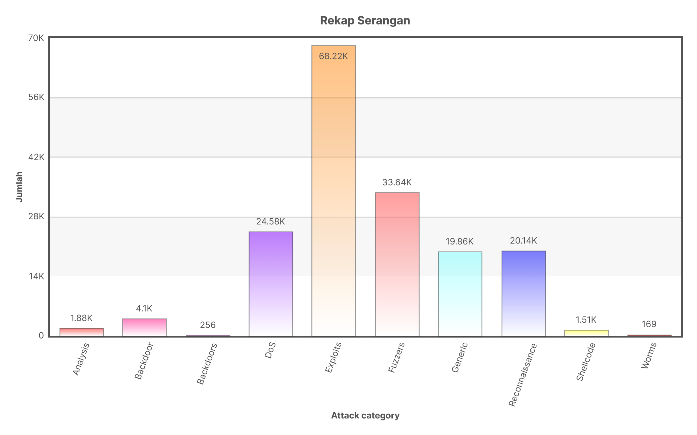

# dataset-cyber-attack
This dataset was taken using scraping from the website [hangtuah.ac.id](https://rock.hangtuah.ac.id/analis/nusw/nuswnb15gtlist).

### Sample data
| No     | Attack_Category | Attack_Sub_Category | Protocol | Source_IP    | Source_Port | Destination_IP | Destination_Port | Attack_Name | Attack_Reference | 
| :----- | :-------------: | :-----------------: | :------: | :----------: | :---------: | :------------: | :--------------: | :---------: | ---------------: |
| 1      | Reconnaissance  | HTTP                | tcp      | 175.45.176.0 | 13284       | 149.171.126.16 | 80               | ...         | ...              |
| 2      | Exploits        | Unix 'r' Service    | udp      | 175.45.176.3 | 21223       | 149.171.126.18 | 32780            | ...         | ...              |
| 3      | Exploits        | Browser             | tcp      | 175.45.176.2 | 23357       | 149.171.126.16 | 80               | ...         | ...              |
| 4      | Exploits        | Miscellaneous Batch | tcp      | 175.45.176.2 | 13792       | 149.171.126.16 | 5555             | ...         | ...              |
| ...    | ...             | ...                 | ...      | ...          | ...         | ...            | ...              | ...         | ...              |
| 174347 | Exploits        | Office Document     | tcp      | 175.45.176.0 | 17293       | 149.171.126.17 | 110              | ...         | ...              |

### Recap Information

